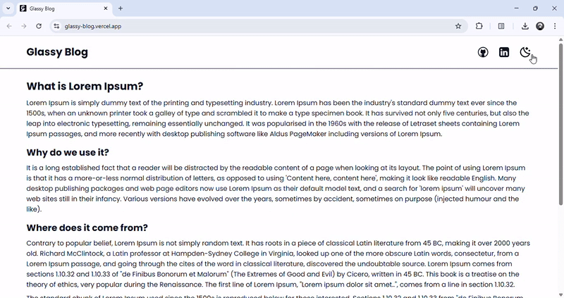
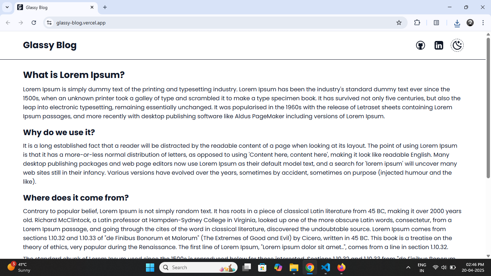
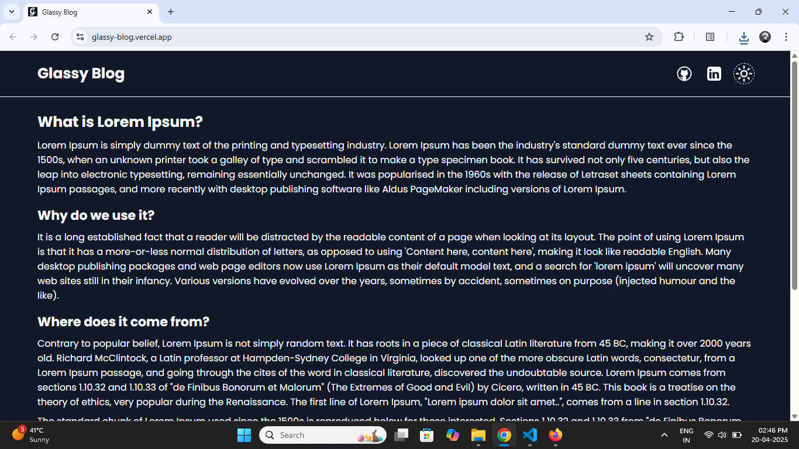

# Glassy Blog

A simple dark/light mode toggle with a **smooth circular zoom animation**, made using the **View Transition API**, vanilla HTML, and CSS. No frameworks, no libraries — just pure frontend experimentation.

---

## How the View Transition API Works

The View Transition API captures the **"before" and "after" snapshots** of the DOM and lets you animate between them.

### Step-by-step:

1. `startViewTransition()` captures the current UI (snapshot A).
2. Inside its callback, you update the DOM (e.g., toggle dark mode).
3. Browser takes another snapshot (snapshot B).
4. It animates from A ➡️ B using `::view-transition-old(root)` and `::view-transition-new(root)` pseudo-elements.


> It's like diffing the UI and animating the change — super clean!

---

## How to Use the View Transition API for Theme Toggle

Want to create a smooth, animated theme switch like Telegram? Here's a breakdown of how to implement the View Transition API step-by-step — with fallback support and a clean circular animation.

### 1️. Add Fallback Support
This API doesn’t work in Firefox or for users who prefer reduced motion. So, always add a fallback to keep the theme toggle functional:

```js
if (!document.startViewTransition || window.matchMedia('(prefers-reduced-motion: reduce)').matches) {
    body.classList.toggle('dark-mode');
    return;
}
```

### 2️. Calculate Button Center

We want the animation to expand from where the user clicked. So first, find the center of the toggle button:

```js
const { top, left, width, height } = button.getBoundingClientRect();
const x = left + width / 2;
const y = top + height / 2;
```

### 3️. Calculate Max Radius

To make sure the animation fully covers the screen, calculate the maximum radius required:

```js
const right = window.innerWidth - left;
const bottom = window.innerHeight - top;
const maxRadius = Math.hypot(Math.max(left, right), Math.max(top, bottom));
```

### 4️. Trigger the DOM Update Inside View Transition

Now we use the View Transition API to apply the theme change inside a transition. This lets the browser capture the before/after states and animate between them.

```js
await document.startViewTransition(() => {
    body.classList.toggle('dark-mode');
}).ready;
```

### 5️. Animate the New Snapshot

Now apply a circular clip-path animation on the new visual state (pseudo element) starting from the button center:

```js
document.documentElement.animate(
    {
        clipPath: [
            `circle(0px at ${x}px ${y}px)`,
            `circle(${maxRadius}px at ${x}px ${y}px)`,
        ],
    },
    {
        duration: 500,
        easing: 'ease-in-out',
        pseudoElement: '::view-transition-new(root)',
    }
);
```

### 6️. Add CSS for View Transition Elements

Don’t forget this part. Without this, your animation might get unexpected behavior or blend weirdly:

```css
/* Required for View Transition to behave as expected */
::view-transition-old(root),
::view-transition-new(root) {
    animation: none;
    mix-blend-mode: normal;
}
```

## Useful Resources

* [MDN View Transition API Documentation](https://developer.mozilla.org/en-US/docs/Web/API/ViewTransition)

* [Full Page Theme Toggle Animation with View Transitions API - Akash Hamirwasia](https://akashhamirwasia.com/blog/full-page-theme-toggle-animation-with-view-transitions-api/)

## Preview 



